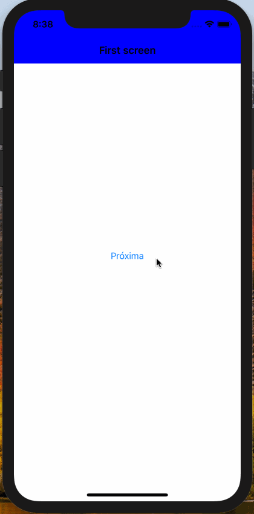

# Navigation Bar Styles

This iOS project show how to change the Navigation Bar style based on which ViewController is being shown.

Currently the only way I've seen working is through is using

```
UIApplication.shared.statusBarStyle = .lightContent // White content
UIApplication.shared.statusBarStyle = .default      // Black content
```

# Results
Usually I've seen the usage of `UIApplicantion` because the `ViewController.preferredStatusBarStyle`, when attached to a `NavigationController`, is completely ignored and the iOS uses the style defined by `NavigationController`.

> I learned this by reading [this article](https://medium.com/swiftindia/status-bar-throwing-tantrums-in-ios-9-ed567e3a8f3b) that explains shortly and also has codes to help.

This project now has two controllers. The `FirstViewController` has a button that calls the `SecondViewController`. Both define their titles and extends `BaseViewController`, that has a `NavigationController` implementation, and the solution of this "problem".

In the `SecondViewController` there is nothing implemented but the override of `preferredStatusBarStyle`.

https://github.com/GustavoAraujoLetras/Navigation-Bar-Style/blob/f3362c01f94bf4c391be7634f490abc9ce37cf78/Navigation%20Bar%20Styles/SecondViewController.swift#L14-L16

By executing it's possible to see that when `SecondViewController` is called, the status bar becomes white  (`UIStatusBarStyle.lightContent`) and whenever the `FirstViewController` is show, the status bar goes back to black (`UIStatusBarStyle.default`)


